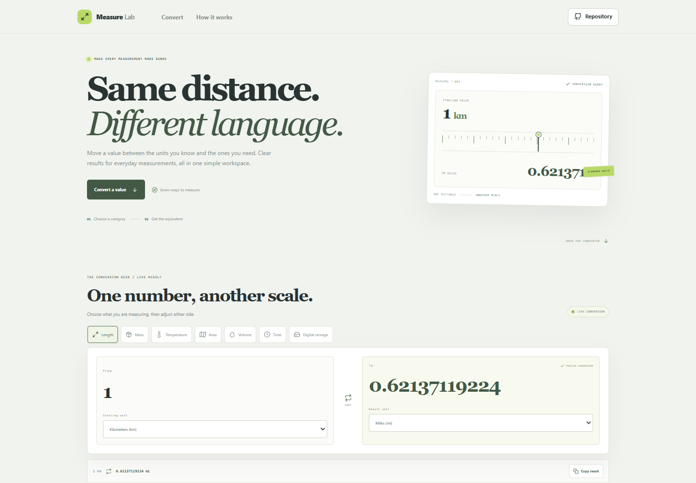



# Unit Converter

Convert a value between common everyday measurements. Choose a category, enter a number, and get a live result with source and destination units clearly labeled.

**Live app:** [https://a2rp.github.io/unit-converter/](https://a2rp.github.io/unit-converter/)

## Categories and features

- Length: meters, kilometers, centimeters, millimeters, feet, inches, and miles.
- Mass: kilograms, grams, milligrams, pounds, ounces, and metric tonnes.
- Temperature: Celsius, Fahrenheit, and Kelvin.
- Area: square meters, square kilometers, square feet, hectares, and acres.
- Volume: liters, milliliters, cubic meters, US gallons, US cups, and US fluid ounces.
- Time: milliseconds, seconds, minutes, hours, days, and weeks.
- Digital storage: bytes, decimal KB/MB/GB, and binary KiB/MiB/GiB.
- Swap source and destination units, then copy the displayed result.
- Responsive controls, keyboard focus styles, and reduced-motion support.

Results show up to 11 significant digits. Storage units are explicit: decimal units use powers of 1,000, while binary units use powers of 1,024.

## Use the converter

1. Select a measurement category.
2. Enter a number in the From field.
3. Choose the source and result units.
4. Swap the units or copy the result if needed.

## Privacy and limitations

Conversion happens in the browser tab. Values are not uploaded or saved by this project. Copying a result uses the browser clipboard when permission is available.

Results use standard unit relationships and may display small floating-point differences at the last shown digit. The selection is not a substitute for specialist, calibrated, or regulated measurement software.

## Development

Requirements: Node.js and npm.

    npm install
    npm run dev

Run checks and create a production build:

    npm test
    npm run lint
    npm run build

Publish to GitHub Pages:

    npm run deploy

## Future improvements

- Add speed, pressure, energy, and power categories.
- Add an optional precision control for decimal places or significant digits.
- Add compact reference tables for common conversions.

## Links

- Portfolio: [https://www.ashishranjan.net](https://www.ashishranjan.net)
- GitHub: [https://github.com/a2rp](https://github.com/a2rp)
- CodePen: [https://codepen.io/ash1198](https://codepen.io/ash1198)
- LinkedIn: [https://www.linkedin.com/in/aashishranjan](https://www.linkedin.com/in/aashishranjan)
- Facebook: [https://www.facebook.com/theash.ashish/](https://www.facebook.com/theash.ashish/)
- YouTube: [https://www.youtube.com/@ashishranjan-ashz?sub_confirmation=1](https://www.youtube.com/@ashishranjan-ashz?sub_confirmation=1)
- Email: [mailto:ash.ranjan09@gmail.com](mailto:ash.ranjan09@gmail.com)

## Support

- Support: [https://a2rp-donation-page.netlify.app/](https://a2rp-donation-page.netlify.app/)
- Buy Me a Coffee: [https://buymeacoffee.com/ashishranjan](https://buymeacoffee.com/ashishranjan)
- Patreon: [https://www.patreon.com/ashishranjan](https://www.patreon.com/ashishranjan)
